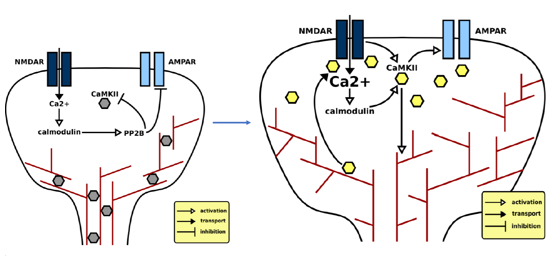

# What is my PhD research question? {#sec-whats-my-phd}

The biological question that started this PhD was how do Calcium/calmodulin-dependent protein kinase II (CaMKII) and N-methyl-D-aspartate receptor (NMDARs) in the postsynaptic neuron interact and enable the processes of learning and memory?

But as time went by, I realised more and more how important looking at the ethics of the research that we do is. How biased science actually is, and how we continue to carry these if we don't look at them in the face. Additionally, how much research time and money is wasted by doing experiments which cannot be reproduced or replicated later on. Hence my emphasis on these topics. 

An additional, and important, aim of this PhD project to highlight and talk about some of the things I care most in research: making it transparent, inclusive, and accessible.

First, let's look at a brief description of the type of interactions I am interested in looking at, and why I model them with computer models.

## What molecular interactions am I modelling?

When studying learning and memory at the molecular level, in health and disease, it has been shown that NMDAR and CaMKII together with their interactions with other proteins within neuronal spines can influence their shape and size [@fink2002Molecular]. Long-term modifications of synaptic strength, such as LTD (Long Term Depression) and LTP (Long Term Potentiation), involve diverse chemical pathways and have been the primary mechanisms used to study the molecular basis of learning and memory [@blundon2008DissectingComponentsLongTerm]. So what exactly is happening at the cellular and molecular level during memory formation?

There are different types of LTP, depending on the type of synapse, the stimulation parameters, the time analysed after LTP induction, and developmental age too. Here we focus on LTP that is dependent on NMDAR activation. This type of LTP has been shown to be important for mechanisms underlying learning and memory. Experiments using mice where they abolished CaMKII and NMDAR resulted in the poor mice to have learning and memory impairments. Disruption of their binding has also been shown to contribute to neurodegeneration, spineopathies and potential memory impairment in diseases such as Alzheimer’s disease [@fink2002Molecular].

### NMDAR-dependent LTP

How does this type of LTP work, then? In NMDA-receptor dependent LTP, glutamate is released from the presynaptic terminal, this glutamate can then activates a subtype of glutamate receptor known as the AMPA receptor. NMDA receptors are found nearby these AMPA receptors, but are not activated by low levels of glutamate release because the ion channel of an NMDA receptor is blocked by a magnesium ion. If frequent action potentials cause greater stimulation of AMPA receptors, however, this will cause the postsynaptic neuron to depolarize, which eventually causes the voltage-dependent magnesium blockage of the NMDA receptor to be removed, allowing calcium ions to flow in through the NMDA receptor. 

The influx of calcium causes a rise in intracellular calcium concentrations in an area of the neuron called the postsynaptic density. The rise of intracellular calcium then triggers a cascade of events, where Ca2+ activates a protein called calmodulin, and calmodulin can then activate CaMKII. The activation of CaMKII can allow for various mechanisms of LTP to proceed. CaMKII can interact with AMPAR and increase their sensitivity to further stimuli. 

An important asset of CaMKII is that it can remain activated/ autophosphorylated for prolonged periods of time, even after the initial calcium stimulus is gone. So, when another stimulus comes along, CaMKII ‘remembers’ (as its autphosphorylated) and can now act “faster” when a new stimulus is received.Also, when activated, CaMKII can bind to NMDA receptors in the membrane of the cell to enhance its efficiency for receiving new stimuli. And in fact, it has been suggested that LTP can be maintained by the complex of activated CaMKII with NMDARs. It is this interaction that I am most interested in focusing my research on.

CaMKII can also be found bound to the actin filaments which form the cytoskeleton of the neuron. Active CaMKII can unbind from these actin filaments which leads to an expansion in shape of the dendritic spine. So this increase in sensitivity to stimuli as well as the expansion of dendritic spines now allow for that synaptic strengthening that I mentioned happens in LTP (@fig-spine_LTP).

{#fig-spine_LTP}

These are the biological prompts that I look at when creating 3D models of the molecules in question. I use mainly [MCell](https://mcell.org/) and python to do so. In order to give you a better overview of the aims, types of data used, methods and applications of this research, please see below @tbl-overview. In addition to the biological aspects of this PhD, as mentioned above, I have made a big effort into making my PhD accessible, reproducible and more ethical. It has transformed into a case study example of how to establish procedures for more ethical and reproducible research, which means future researchers can efficiently re-use and build up on what I have created.

+--------------------------------------------------------------------------------------------------------------------------------------------------------------------------------------------------------------------------+
| Wide-view angle of this PhD project                                                                                                                                                                                      |
+==========================================================================================================================================================================================================================+
| **Aims of this PhD:**                                                                                                                                                                                                    |
|                                                                                                                                                                                                                          |
| -   Explain how specific molecules work together during memory.                                                                                                                                                          |
|                                                                                                                                                                                                                          |
| -   Develop new ways of 3D modelling to look at time and space dynamics of molecular interactions.                                                                                                                       |
|                                                                                                                                                                                                                          |
| -   Bring awareness of the importance of implementing ethics and reproducibility into a PhD.                                                                                                                             |
+--------------------------------------------------------------------------------------------------------------------------------------------------------------------------------------------------------------------------+
| **Type of data used:**                                                                                                                                                                                                   |
|                                                                                                                                                                                                                          |
| -   Kinetic rates of molecule interactions, molecular concentrations collected from literature and databases.                                                                                                             |
|                                                                                                                                                                                                                          |
| -   Numbers obtained from either wet-lab experiments or mathematically calculated.                                                                                                                                       |
+--------------------------------------------------------------------------------------------------------------------------------------------------------------------------------------------------------------------------+
| **Methods:**                                                                                                                                                                                                             |
|                                                                                                                                                                                                                          |
| -   Models written with standardised open source languages: python, bionetgen Language.                                                                                                                                  |
|                                                                                                                                                                                                                          |
| -   Numbers obtained from either wet-lab experiments or mathematically calculated.                                                                                                                                       |
|                                                                                                                                                                                                                          |
| -   Run locally or in cluster if simulations are more computationally expensive.                                                                                                                                         |
+--------------------------------------------------------------------------------------------------------------------------------------------------------------------------------------------------------------------------+
| **Applications and significance**                                                                                                                                                                                        |
|                                                                                                                                                                                                                          |
| -   Other researchers can build from these models to create further predictions for potential pharmacological applications.                                                                                              |
|                                                                                                                                                                                                                          |
| -   Dysregulation of the molecules I look at have been suggested to have a potential impact in Alzheimer's disease, as well associated with multiple forms of spineopathies [@ghosh2015Calcium], [@robison2014Emerging]. |
+--------------------------------------------------------------------------------------------------------------------------------------------------------------------------------------------------------------------------+

: PhD overview {#tbl-overview}

To give a better idea of what the modelling might look like, I drew @fig-cellblender, which shows a somewhat simplified version of what the graphical user interface of CellBlender can look like. It includes molecules and reactions, as well as placement in a 3D cell.

**In brief, I create 3D models which simulate interactions between CaMKII and NMDAR in the postsynaptic neuron, to understand how memory works in animal brains.**



## Why use Computational Modelling to study biological systems?

Some of the main reasons for using modelling are:

1.  Biological systems are complex and multiscale. Models can help us to integrate experimental data, facilitating theoretical hypotheses, and addressing "what if" questions.

2.  Models aim to make clear the current state of knowledge regarding a particular system, by attempting to be precise about the elements involved and the interactions between them. Doing this can be an effective way to highlight gaps in understanding.

3.  Related to point one, models then serve to combine knowledge from different published research, and make biological predictions which can then serve as hypothesis to be tested empirically by experimentalists.

4.  Computer-simulated experiments can help guide the wet-lab process by narrowing the experimental search space, enabling more cost, time-effective and waste-free research, as well as more ethical research too as we reduce animal suffering through reduction of animal research.

{#fig-cellblender}
