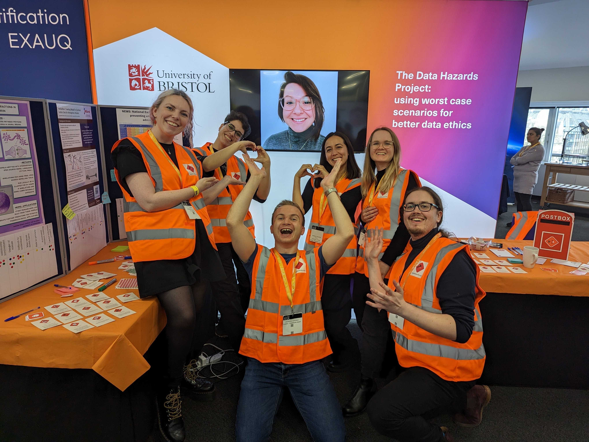

# Alan Turing Enrichment Scheme

*"The Enrichment scheme is designed to give students the opportunity to enhance, refresh, and broaden their research with the Turing’s community and in recognition of their place within the UK’s growing data science and AI research community. Placement Award holders receive funding to physically access the Institute’s facilities whilst also building both online communities and facilitating other activities such as attending training courses, going to conferences and visiting collaborators."* [Enrichment Scheme](https://www.turing.ac.uk/work-turing/studentships/enrichment).

Some of my main goals when starting the Enrichment scheme were to broaden my knowledge on how other people are focusing their efforts into creating more accessible, ethical and reproducible research. In order to do so, I joined various courses, collaborated with different teams and got involved with the community through different routes, as described below.

My placement as an Enrichment student started in October 2022 and ends in June 2023. It was not an interruption of my PhD but rather an experience to make my PhD more rich in collaborations and skills. Which I really think is what happened, as I am now finishing my time here, I leave with so many more skills on organising events, creating accessible spaces and research, creating more reproducible code, and great collaborations and friendships have flourished from my time at the Alan Turing Institute.

## Courses:

### **[Turing Commons: AI Ethics and Governance course](https://www.eventsforce.net/turingevents/frontend/reg/thome.csp?pageID=81509&eventID=232&traceRedir=2)**. 

This was a 2 weeks course. Some of the main learning outcomes in this course were to get acquainted with topics such as AI harms and values, stakeholder engagement process and impact assessment and fairness, bias mitigation, governance, and accountability.

### **[Research Software Engineering with Python](https://alan-turing-institute.github.io/rse-course/html/index.html)**.

This was a 5 days deep-dive into learning how to construct reliable, readable, efficient research software in a collaborative environment. The emphasis is on practical techniques, tips, and technologies to effectively build and maintain complex code. 

These topics were never directly and fully taught to me in any university module, so it was really good to interact with colleagues and learn together how to implement proper version control and create research that will be able to be reproduced later on.

## Collaborations:

### **[Open Science & Reproducibility: The Turing Way Workshop](https://zenodo.org/record/7704563#.ZAdfCLTP2CM).**

Together with Anne Lee Steele, community manager at the Turing Way, I helped facilitate this workshop. It was presented at Newcastle University's conference from 6-7 March 2023: "Data Science Perspectives - Multidisciplinary PhD Conference".

I was able to include my previous work for the bias and reproducibility poster mentioned above, as well as network with other PhD students that were interested in these topics too. 

### **[Data Ethics and Reproducible Research (DERR) Symposium](https://www.eventbrite.co.uk/e/online-data-hazards-ethics-and-reproducibility-one-day-symposium-tickets-517490858087?keep_tld=1)**

**Awarded: £2000 Grassroots Funding (GFT) from Alan Turing Institute.**

Together with another enrichment student, Ceilidh Welsh, we applied for funding through the GFT to organise a one-day symposium.

The Data Ethics and Reproducible Research (DERR) Symposium was a one-day event held at the Alan Turing Institute 10th March 2023. This symposium aimed to showcase implementations of  reproducibility and ethics for research.
The symposium structure included a variety of speakers, an interactive workshop and networking oppurtunities.

A central part of this symposium was the [Data Hazards](https://datahazards.com/index.html) Workshop ([relating to section above](#data-hazards-workshop)) to provide a collaborative training opportunity for attendees. This type of workshop encourages attendees to explore, discuss and reflect on the ethical implications and wider societal impact of specific data-intensive projects. 

It was an opportunity for attendees to appreciate that ethics is complex, situational and important to discuss in our own contexts. It aims to shine a light on an event that promotes data ethics through the content of the event, and also its planning and delivery.

We were the first people to request this funding, as it was a new type of funding given by the Instiute, so we ended up helping shape the documentation and requirements for this award. 

We hosted this event as a hybrid in order to make it more accessible. We ended up having 18 participants in person and 11 online. In order to create an output from this event, we joined the Turing Way Bookdash this May 2023, to add a chapter in the [Turing Way Book](https://the-turing-way.netlify.app/index.html) about Data Hazards, as well as to talk about our symposium as a case study to apply thinking about these topics.

### **Turing Way Book Dash**

As per the Turing Way's definition of what a book dash is: 

*"The Turing Way [Book Dash](https://the-turing-way.netlify.app/community-handbook/bookdash.html) events are a less intense version of [Book Sprints](https://en.wikipedia.org/wiki/Book_sprint), where participants collaboratively work on The Turing Way book synchronously to develop new chapters and review/edit existing ones to make them more accessible, comprehensive and up-to-date. They also contribute to enhancing the project by improving the ways we work in the community and take the lead on accomplishing different tasks or subprojects."*

I joined the Book Dash together with Ceilidh Welsh, who I organised the symposium with, and Natalie Zelenka, one of the project leads of the Data Hazards project. During the Book Dash event, Irma Hafidz, a PhD student at Loughborough University, UK joined us to give her input as someone who had not been so directly involved with the project. This way, it was great to have people who had been involved at different levels with this project come together to write a chapter for the Turing Way.

Our current chapter is in draft form [here](https://hackmd.io/@7D_si7-qQwKdepUrj7_AzA/DH_chapter). And we are working together to publish it, potentially in the upcoming Book Dash in  November 2023. 

## Community involvement:

### **Community Champion for the Enrichment 2022 cohort**

I applied to become one of the community champions, whose role aims to play an active part in promoting engagement and cohort building among the students and the rest of the Turing community. During my time as an community champion, I:

- Reached out to the student community for ideas around cohort building activities.

- Promoted engagement and cohort building among the students, including the virtual community of students, and the rest of the Turing community.

- Encouraged and offered support to peers organising cohort building activities (e.g. regular coffee chats, socials). And acted as a signpost to Academic Services for advice.

- Encouraged / supported other students with Grassroots Training Fund activities. 

### **Volunteer at AI UK**

At AI UK, hosted by the Alan Turing Institute, I volunteered to help around on the day as well as a facilitator in the Data Hazards stand, where I had a poster for people to think about what hazards apply to my project.

The poster I presented can be found [here](https://github.com/Susana465/DH_Project_CaseStudy).

